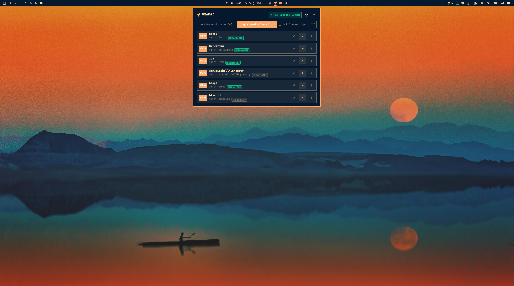
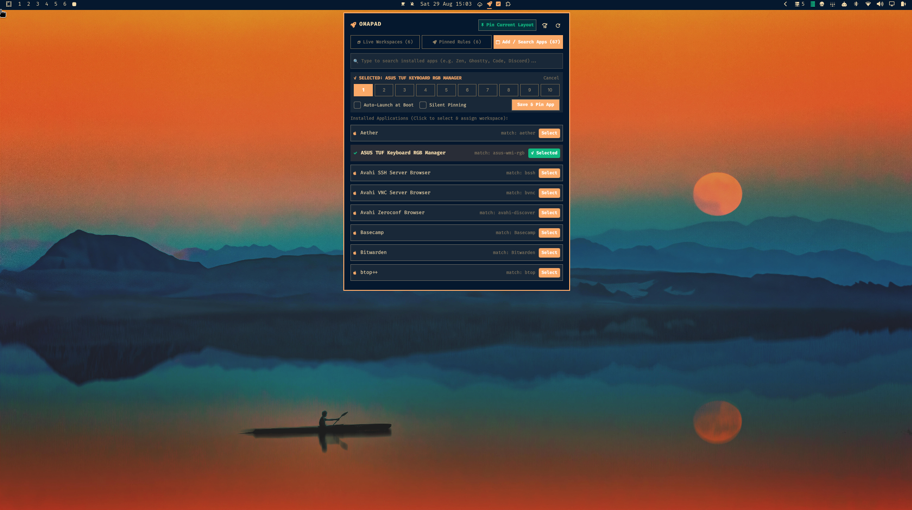

# OmaPad: App-to-Workspace and Auto-Launch Manager for Omarchy

Declaratively pin applications to Hyprland workspaces and auto-launch them at boot, driven by an interactive application picker and live workspace inspector.



---

## Features

- **Live Workspace Inspector and 1-Click Pinning**:
  - Automatically discovers all active Hyprland workspaces and currently running windows.
  - 1-click Pin Current Layout header button remembers your open windows for subsequent boots.
  - Per-window Remember / Pin action directly inside each workspace card.
- **Searchable Installed Applications Picker**:
  - Scans all installed desktop applications and running windows automatically.
  - Real-time search filter across application names, window classes, and execution commands.
  - 1-click workspace assigner (`WS 1` through `WS 10`).
- **Boot Launch and Silent Pinning**:
  - 1-click interactive Boot toggle (`Boot: ON` / `Boot: OFF`) directly on pinned rule cards.
  - Silent pinning option opens applications without pulling focus from your active workspace.
- **Instant Repositioning (`M`)**:
  - 1-click button and keyboard shortcut to relocate all open windows to their assigned workspaces using native Hyprland address dispatching.
- **Zero Hand-Editing**:
  - Automatically generates `~/.config/hypr/launchpad.lua` and reloads Hyprland cleanly.

---

## Previews



---

## Keyboard Shortcuts

| Key | Action |
|---|---|
| `1` | Switch to Live Workspaces tab |
| `2` | Switch to Pinned Rules tab |
| `3` | Switch to Add / Search Apps tab (focuses search box) |
| `Up` / `Down` or `k` / `j` | Navigate items and scroll list |
| `Enter` / `Space` | Switch to workspace, toggle boot rule, or launch selected app |
| `x` / `Delete` | Remove selected rule in Rules tab |
| `p` / `P` | Pin current open window layout |
| `m` / `M` / `a` | Reposition open windows now to assigned workspaces |
| `r` / `R` | Sync rules and reload Hyprland |
| `Esc` | Clear search focus or close flyout |

---

## Configuration

Rules are managed in the UI and stored in `~/.config/omarchy/launchpad.json`:
```json
{
  "version": 1,
  "entries": [
    {
      "id": "Zen Browser",
      "match": "zen",
      "command": "zen",
      "workspace": 1,
      "launchAtBoot": true,
      "silent": false
    }
  ]
}
```

---

## License

MIT License (c) 2026 Kiryuuki
